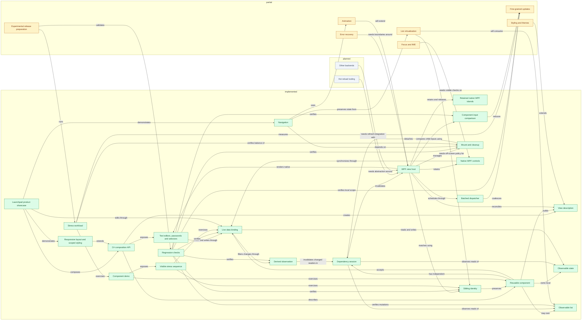

# UI Framework knowledge graph

Generated from knowledge-graph.json. Edit that file and run tools/Update-KnowledgeGraph.ps1. This is a maintained architecture graph; planned nodes describe future work, not implemented APIs.

Green: implemented. Amber: partial. Gray: planned.

## Source index

| Concept | Status | Contract / limitation | Sources |
| --- | --- | --- | --- |
| Retained native WPF islands | implemented | Core carries an opaque platform description. WPF Interop owns native factories, declared-type identity, updates, detachment and one-time release; apps own native contents and durable state. | [UI Framework/View.cs](../UI%20Framework/View.cs), [UI Framework/ViewKind.cs](../UI%20Framework/ViewKind.cs), [UI Framework.Wpf/Interop/WpfUI.cs](../UI%20Framework.Wpf/Interop/WpfUI.cs), [UI Framework.Wpf/Interop/NativeViewDescriptor.cs](../UI%20Framework.Wpf/Interop/NativeViewDescriptor.cs), [UI Framework.Wpf/Interop/NativeControlHost.cs](../UI%20Framework.Wpf/Interop/NativeControlHost.cs), [tests/UI Framework.Checks/NativeHostTests.cs](../tests/UI%20Framework.Checks/NativeHostTests.cs), [docs/native-interop.md](../docs/native-interop.md) |
| Text editors, passwords and selectors | implemented | Core describes bound multiline text, masked passwords and indexed pickers. WPF owns native editing, read-only selection, bounded undo, theme integration and feedback suppression. | [UI Framework/UI.cs](../UI%20Framework/UI.cs), [UI Framework/View.cs](../UI%20Framework/View.cs), [UI Framework/ViewKind.cs](../UI%20Framework/ViewKind.cs), [UI Framework.Wpf/Rendering/Node.cs](../UI%20Framework.Wpf/Rendering/Node.cs), [UI Framework.Wpf/ViewHost.cs](../UI%20Framework.Wpf/ViewHost.cs), [UI Framework.Wpf/Styling/ThemeStyles.cs](../UI%20Framework.Wpf/Styling/ThemeStyles.cs), [tests/UI Framework.Checks/EditorTests.cs](../tests/UI%20Framework.Checks/EditorTests.cs), [tests/UI Framework.Checks/PickerStyleTests.cs](../tests/UI%20Framework.Checks/PickerStyleTests.cs), [UI Framework.Wpf/Styling/PickerStyles.cs](../UI%20Framework.Wpf/Styling/PickerStyles.cs), [docs/editors.md](../docs/editors.md) |
| Responsive layout and scoped styling | implemented | Core defines weighted rows, adaptive grids, alignment and theme tokens. WPF owns measurement, native templates, rich button content presentation and interaction states. Applications own native content and data templates; Launchpad supplies application design. | [UI Framework/Layout/ViewAlignment.cs](../UI%20Framework/Layout/ViewAlignment.cs), [UI Framework/Styling/ThemeTokens.cs](../UI%20Framework/Styling/ThemeTokens.cs), [UI Framework/Styling/ButtonStyleKind.cs](../UI%20Framework/Styling/ButtonStyleKind.cs), [UI Framework.Wpf/Layout/AdaptivePanel.cs](../UI%20Framework.Wpf/Layout/AdaptivePanel.cs), [UI Framework.Wpf/Styling/ThemeStyles.cs](../UI%20Framework.Wpf/Styling/ThemeStyles.cs), [UI Framework.Wpf/Styling/ButtonContentPresenter.cs](../UI%20Framework.Wpf/Styling/ButtonContentPresenter.cs), [tests/UI Framework.Checks/ButtonContentTests.cs](../tests/UI%20Framework.Checks/ButtonContentTests.cs), [samples/Counter/Models/LaunchTheme.cs](../samples/Counter/Models/LaunchTheme.cs), [tests/UI Framework.Checks/LayoutStyleTests.cs](../tests/UI%20Framework.Checks/LayoutStyleTests.cs), [UI Framework.Wpf/Styling/ToggleStyles.cs](../UI%20Framework.Wpf/Styling/ToggleStyles.cs), [tests/UI Framework.Checks/ToggleStyleTests.cs](../tests/UI%20Framework.Checks/ToggleStyleTests.cs), [docs/layout-styling.md](../docs/layout-styling.md) |
| Launchpad product showcase | implemented | Session-only Overview, Board and Details screens with Back, retained local preferences, edits and workflow actions. Sample models own routes; WPF owns native screen lifetime. | [samples/Counter/Components/Launchpad.cs](../samples/Counter/Components/Launchpad.cs), [samples/Counter/Components/LaunchOverview.cs](../samples/Counter/Components/LaunchOverview.cs), [samples/Counter/Components/LaunchBoard.cs](../samples/Counter/Components/LaunchBoard.cs), [samples/Counter/Components/LaunchDetails.cs](../samples/Counter/Components/LaunchDetails.cs), [samples/Counter/Models/LaunchRoute.cs](../samples/Counter/Models/LaunchRoute.cs), [samples/Counter/Models/LaunchScreen.cs](../samples/Counter/Models/LaunchScreen.cs), [samples/Counter/Diagnostics/LaunchNavigationChecks.cs](../samples/Counter/Diagnostics/LaunchNavigationChecks.cs), [samples/Counter/Models/LaunchModel.cs](../samples/Counter/Models/LaunchModel.cs), [samples/Counter/Models/LaunchItem.cs](../samples/Counter/Models/LaunchItem.cs), [samples/Counter/Models/LaunchStage.cs](../samples/Counter/Models/LaunchStage.cs), [samples/Counter/LaunchpadWindow.cs](../samples/Counter/LaunchpadWindow.cs), [docs/launchpad.md](../docs/launchpad.md) |
| C# composition API | implemented | Text, Button, TextField, TextEditor, PasswordField, Picker, Toggle, Scroll, stacks, modifiers, and Component<T> factories. | [UI Framework/ViewKind.cs](../UI%20Framework/ViewKind.cs), [UI Framework/View.cs](../UI%20Framework/View.cs), [UI Framework/UI.cs](../UI%20Framework/UI.cs) |
| View description | implemented | Records describe a view tree without owning native controls. | [UI Framework/ViewKind.cs](../UI%20Framework/ViewKind.cs), [UI Framework/View.cs](../UI%20Framework/View.cs), [UI Framework/UI.cs](../UI%20Framework/UI.cs) |
| Reusable component | implemented | Retained instance with Body, local state, props, and lifetime hooks. | [UI Framework/Component.cs](../UI%20Framework/Component.cs), [docs/components.md](../docs/components.md) |
| Observable state | implemented | Tracks value reads and notifies on unequal assignments. | [UI Framework/IState.cs](../UI%20Framework/IState.cs), [UI Framework/ObservableState.cs](../UI%20Framework/ObservableState.cs), [UI Framework/State.cs](../UI%20Framework/State.cs), [UI Framework/Dependencies.cs](../UI%20Framework/Dependencies.cs), [UI Framework/ViewSession.cs](../UI%20Framework/ViewSession.cs) |
| Observable list | implemented | Tracks collection reads and structural mutations, not arbitrary item properties. | [UI Framework/StateList.cs](../UI%20Framework/StateList.cs) |
| Dependency session | implemented | Each body/configure build records dependencies and removes stale subscriptions. | [UI Framework/IState.cs](../UI%20Framework/IState.cs), [UI Framework/ObservableState.cs](../UI%20Framework/ObservableState.cs), [UI Framework/State.cs](../UI%20Framework/State.cs), [UI Framework/Dependencies.cs](../UI%20Framework/Dependencies.cs), [UI Framework/ViewSession.cs](../UI%20Framework/ViewSession.cs) |
| WPF view host | implemented | Owns one render session and reconciles descriptions with retained controls. Unchanged sibling order patches directly; structural changes use keyed reconciliation. | [UI Framework.Wpf/ViewHost.cs](../UI%20Framework.Wpf/ViewHost.cs), [UI Framework.Wpf/Rendering/Node.cs](../UI%20Framework.Wpf/Rendering/Node.cs) |
| Batched dispatcher | implemented | Coalesces invalidations into pending UI-thread renders. | [UI Framework.Wpf/ViewHost.cs](../UI%20Framework.Wpf/ViewHost.cs), [UI Framework.Wpf/Rendering/Node.cs](../UI%20Framework.Wpf/Rendering/Node.cs) |
| Sibling identity | implemented | Parent, key or position, kind, and component type determine reuse. | [UI Framework.Wpf/ViewHost.cs](../UI%20Framework.Wpf/ViewHost.cs), [UI Framework.Wpf/Rendering/Node.cs](../UI%20Framework.Wpf/Rendering/Node.cs), [docs/components.md](../docs/components.md) |
| Mount and cleanup | implemented | Subtree dependencies detach before unmount hooks; removed instances are released. | [UI Framework/Component.cs](../UI%20Framework/Component.cs), [UI Framework.Wpf/ViewHost.cs](../UI%20Framework.Wpf/ViewHost.cs), [UI Framework.Wpf/Rendering/Node.cs](../UI%20Framework.Wpf/Rendering/Node.cs) |
| Native WPF controls | implemented | TextBlock, Button, TextBox, StackPanel, and Border provide Windows UI. | [UI Framework.Wpf/ViewHost.cs](../UI%20Framework.Wpf/ViewHost.cs), [UI Framework.Wpf/Rendering/Node.cs](../UI%20Framework.Wpf/Rendering/Node.cs) |
| Regression checks | implemented | Executable assertions for state, components, identity, lifecycle, and scheduling. | [tests/UI Framework.Checks/FrameworkTests.cs](../tests/UI%20Framework.Checks/FrameworkTests.cs), [tests/UI Framework.Checks/PrimitiveTests.cs](../tests/UI%20Framework.Checks/PrimitiveTests.cs), [tests/UI Framework.Checks/StateSessionTests.cs](../tests/UI%20Framework.Checks/StateSessionTests.cs), [tests/UI Framework.Checks/VirtualizationTests.cs](../tests/UI%20Framework.Checks/VirtualizationTests.cs), [tests/UI Framework.Checks/ComponentChecks.cs](../tests/UI%20Framework.Checks/ComponentChecks.cs), [tests/UI Framework.Checks/Probes/MountMutation.cs](../tests/UI%20Framework.Checks/Probes/MountMutation.cs), [tests/UI Framework.Checks/Probes/OtherProbe.cs](../tests/UI%20Framework.Checks/Probes/OtherProbe.cs), [tests/UI Framework.Checks/Probes/Probe.cs](../tests/UI%20Framework.Checks/Probes/Probe.cs), [tests/UI Framework.Checks/BindingChecks.cs](../tests/UI%20Framework.Checks/BindingChecks.cs), [tests/UI Framework.Checks/Probes/Profile.cs](../tests/UI%20Framework.Checks/Probes/Profile.cs), [tests/UI Framework.Checks/Probes/Preferences.cs](../tests/UI%20Framework.Checks/Probes/Preferences.cs), [tests/UI Framework.Checks/OptimizationChecks.cs](../tests/UI%20Framework.Checks/OptimizationChecks.cs), [tests/UI Framework.Checks/Probes/SelectionProbe.cs](../tests/UI%20Framework.Checks/Probes/SelectionProbe.cs), [tests/UI Framework.Checks/Probes/CallbackProbe.cs](../tests/UI%20Framework.Checks/Probes/CallbackProbe.cs), [tests/UI Framework.Checks/Probes/MemoProbe.cs](../tests/UI%20Framework.Checks/Probes/MemoProbe.cs), [tests/UI Framework.Checks/Probes/Pair.cs](../tests/UI%20Framework.Checks/Probes/Pair.cs) |
| Component demo | implemented | Project board with shared editors, nested checklists, filters, preferences, telemetry, and recursive components. | [samples/Counter/Program.cs](../samples/Counter/Program.cs), [samples/Counter/Components/LabComponent.cs](../samples/Counter/Components/LabComponent.cs), [samples/Counter/Components/Dashboard.cs](../samples/Counter/Components/Dashboard.cs), [samples/Counter/Components/CommandBar.cs](../samples/Counter/Components/CommandBar.cs), [samples/Counter/Components/VisualStressPanel.cs](../samples/Counter/Components/VisualStressPanel.cs), [samples/Counter/Components/SummaryPanel.cs](../samples/Counter/Components/SummaryPanel.cs), [samples/Counter/Components/FilterPanel.cs](../samples/Counter/Components/FilterPanel.cs), [samples/Counter/Components/BoardSlot.cs](../samples/Counter/Components/BoardSlot.cs), [samples/Counter/Components/WorkList.cs](../samples/Counter/Components/WorkList.cs), [samples/Counter/Components/WorkRow.cs](../samples/Counter/Components/WorkRow.cs), [samples/Counter/Components/Inspector.cs](../samples/Counter/Components/Inspector.cs), [samples/Counter/Components/ItemEditor.cs](../samples/Counter/Components/ItemEditor.cs), [samples/Counter/Components/ChecklistPanel.cs](../samples/Counter/Components/ChecklistPanel.cs), [samples/Counter/Components/ChecklistRow.cs](../samples/Counter/Components/ChecklistRow.cs), [samples/Counter/Components/ProjectPanel.cs](../samples/Counter/Components/ProjectPanel.cs), [samples/Counter/Components/TelemetryPanel.cs](../samples/Counter/Components/TelemetryPanel.cs), [samples/Counter/Components/DepthPanel.cs](../samples/Counter/Components/DepthPanel.cs), [samples/Counter/Components/DepthNode.cs](../samples/Counter/Components/DepthNode.cs), [samples/Counter/Components/ActivityPanel.cs](../samples/Counter/Components/ActivityPanel.cs), [samples/Counter/Models/Preferences.cs](../samples/Counter/Models/Preferences.cs), [samples/Counter/Models/ProjectSettings.cs](../samples/Counter/Models/ProjectSettings.cs), [samples/Counter/Models/WorkDetails.cs](../samples/Counter/Models/WorkDetails.cs), [samples/Counter/Models/WorkData.cs](../samples/Counter/Models/WorkData.cs), [samples/Counter/Models/StepData.cs](../samples/Counter/Models/StepData.cs), [samples/Counter/Models/VisualStressState.cs](../samples/Counter/Models/VisualStressState.cs), [samples/Counter/Models/ChecklistItem.cs](../samples/Counter/Models/ChecklistItem.cs), [samples/Counter/Models/WorkItem.cs](../samples/Counter/Models/WorkItem.cs), [samples/Counter/Models/Counters.cs](../samples/Counter/Models/Counters.cs), [samples/Counter/Models/WorkspaceModel.cs](../samples/Counter/Models/WorkspaceModel.cs) |
| Fine-grained updates | partial | Projected observation, local scheduling, and opt-in Memo reduce rebuilds; genuinely broad changes and native layout remain expensive. | [docs/performance.md](../docs/performance.md), [UI Framework/Computed.cs](../UI%20Framework/Computed.cs), [UI Framework.Wpf/ViewHost.cs](../UI%20Framework.Wpf/ViewHost.cs), [UI Framework.Wpf/Rendering/Node.cs](../UI%20Framework.Wpf/Rendering/Node.cs) |
| Focus and IME | partial | Controls/text/selection retained in checks; visible keyboard focus and IME need verification. | [README.md](../README.md), [tests/UI Framework.Checks/ComponentChecks.cs](../tests/UI%20Framework.Checks/ComponentChecks.cs), [tests/UI Framework.Checks/Probes/MountMutation.cs](../tests/UI%20Framework.Checks/Probes/MountMutation.cs), [tests/UI Framework.Checks/Probes/OtherProbe.cs](../tests/UI%20Framework.Checks/Probes/OtherProbe.cs), [tests/UI Framework.Checks/Probes/Probe.cs](../tests/UI%20Framework.Checks/Probes/Probe.cs) |
| Error recovery | partial | Failed builds preserve previous subscriptions; renderer rollback and error boundaries remain open. | [UI Framework/IState.cs](../UI%20Framework/IState.cs), [UI Framework/ObservableState.cs](../UI%20Framework/ObservableState.cs), [UI Framework/State.cs](../UI%20Framework/State.cs), [UI Framework/Dependencies.cs](../UI%20Framework/Dependencies.cs), [UI Framework/ViewSession.cs](../UI%20Framework/ViewSession.cs), [README.md](../README.md) |
| Styling and themes | partial | Basic dimensions, colors, corners, text size, spacing; advanced themes and style systems remain open. | [UI Framework/ViewKind.cs](../UI%20Framework/ViewKind.cs), [UI Framework/View.cs](../UI%20Framework/View.cs), [UI Framework/UI.cs](../UI%20Framework/UI.cs), [UI Framework.Wpf/ViewHost.cs](../UI%20Framework.Wpf/ViewHost.cs), [UI Framework.Wpf/Rendering/Node.cs](../UI%20Framework.Wpf/Rendering/Node.cs), [README.md](../README.md) |
| Navigation | implemented | Core owns observable typed history and entry identity; WPF owns active-screen lifetime and logical snapshots, including nested navigation and virtual rows. | [UI Framework/Navigation/NavigationStack.cs](../UI%20Framework/Navigation/NavigationStack.cs), [UI Framework/Navigation/NavigationEntry.cs](../UI%20Framework/Navigation/NavigationEntry.cs), [UI Framework.Wpf/Navigation/NavigationSurface.cs](../UI%20Framework.Wpf/Navigation/NavigationSurface.cs), [UI Framework.Wpf/Navigation/NavigationSnapshot.cs](../UI%20Framework.Wpf/Navigation/NavigationSnapshot.cs), [UI Framework.Wpf/Rendering/NodeSnapshot.cs](../UI%20Framework.Wpf/Rendering/NodeSnapshot.cs), [UI Framework.Wpf/Virtualization/VirtualListSnapshot.cs](../UI%20Framework.Wpf/Virtualization/VirtualListSnapshot.cs), [tests/UI Framework.Checks/NavigationTests.cs](../tests/UI%20Framework.Checks/NavigationTests.cs), [docs/navigation.md](../docs/navigation.md) |
| List virtualization | partial | WPF viewport realization, keyed snapshots and incremental collection updates; focus, IME and accessibility verification remain. | [UI Framework.Wpf/Virtualization/VirtualListControl.cs](../UI%20Framework.Wpf/Virtualization/VirtualListControl.cs), [UI Framework.Wpf/Virtualization/VirtualRowPresenter.cs](../UI%20Framework.Wpf/Virtualization/VirtualRowPresenter.cs), [UI Framework.Wpf/Rendering/NodeSnapshot.cs](../UI%20Framework.Wpf/Rendering/NodeSnapshot.cs), [tests/UI Framework.Checks/VirtualizationTests.cs](../tests/UI%20Framework.Checks/VirtualizationTests.cs), [docs/virtualization.md](../docs/virtualization.md) |
| Animation | partial | WPF screen entry fade/slide transitions with interruption cleanup and reduced-motion support. General animatable view properties remain planned. | [UI Framework/Navigation/NavigationTransition.cs](../UI%20Framework/Navigation/NavigationTransition.cs), [UI Framework.Wpf/Navigation/NavigationSurface.cs](../UI%20Framework.Wpf/Navigation/NavigationSurface.cs), [docs/navigation.md](../docs/navigation.md) |
| Hot reload tooling | planned | Framework-specific refresh integration and state policies for code updates. | [README.md](../README.md) |
| Other backends | planned | A rendering abstraction and non-Windows implementations. | [README.md](../README.md) |
| Live data binding | implemented | Live direct and record-projected binding with result equality filtering and accepted-value readback. | [UI Framework/Binding.cs](../UI%20Framework/Binding.cs), [docs/bindings.md](../docs/bindings.md), [tests/UI Framework.Checks/BindingChecks.cs](../tests/UI%20Framework.Checks/BindingChecks.cs), [tests/UI Framework.Checks/Probes/Profile.cs](../tests/UI%20Framework.Checks/Probes/Profile.cs), [tests/UI Framework.Checks/Probes/Preferences.cs](../tests/UI%20Framework.Checks/Probes/Preferences.cs) |
| Stress workload | implemented | 1000 mounted rows, 10000 projected writes, mixed edits, filters, remounts, and lifecycle balance measurements. | [samples/Counter/StressRunner.cs](../samples/Counter/StressRunner.cs), [samples/Counter/Diagnostics/Measurement.cs](../samples/Counter/Diagnostics/Measurement.cs), [docs/stress-lab.md](../docs/stress-lab.md), [docs/performance-results.md](../docs/performance-results.md), [docs/performance-guardrails.md](../docs/performance-guardrails.md), [tools/Test-Performance.ps1](../tools/Test-Performance.ps1), [tools/performance-baseline.json](../tools/performance-baseline.json) |
| Derived observation | implemented | Computed values and State selectors notify only when their results change; subscriptions detach with the last reader. | [UI Framework/Computed.cs](../UI%20Framework/Computed.cs), [UI Framework/Binding.cs](../UI%20Framework/Binding.cs), [docs/performance.md](../docs/performance.md) |
| Component input comparison | implemented | Explicit immutable Memo inputs skip unchanged parent-driven child builds while preserving local updates. | [UI Framework/ViewKind.cs](../UI%20Framework/ViewKind.cs), [UI Framework/View.cs](../UI%20Framework/View.cs), [UI Framework/UI.cs](../UI%20Framework/UI.cs), [UI Framework.Wpf/ViewHost.cs](../UI%20Framework.Wpf/ViewHost.cs), [UI Framework.Wpf/Rendering/Node.cs](../UI%20Framework.Wpf/Rendering/Node.cs), [tests/UI Framework.Checks/OptimizationChecks.cs](../tests/UI%20Framework.Checks/OptimizationChecks.cs), [tests/UI Framework.Checks/Probes/SelectionProbe.cs](../tests/UI%20Framework.Checks/Probes/SelectionProbe.cs), [tests/UI Framework.Checks/Probes/CallbackProbe.cs](../tests/UI%20Framework.Checks/Probes/CallbackProbe.cs), [tests/UI Framework.Checks/Probes/MemoProbe.cs](../tests/UI%20Framework.Checks/Probes/MemoProbe.cs), [tests/UI Framework.Checks/Probes/Pair.cs](../tests/UI%20Framework.Checks/Probes/Pair.cs) |
| Visible stress sequence | implemented | A button runs 60 paced visible UI mutations with action highlighting, progress, and cancellation. | [samples/Counter/Models/Preferences.cs](../samples/Counter/Models/Preferences.cs), [samples/Counter/Models/ProjectSettings.cs](../samples/Counter/Models/ProjectSettings.cs), [samples/Counter/Models/WorkDetails.cs](../samples/Counter/Models/WorkDetails.cs), [samples/Counter/Models/WorkData.cs](../samples/Counter/Models/WorkData.cs), [samples/Counter/Models/StepData.cs](../samples/Counter/Models/StepData.cs), [samples/Counter/Models/VisualStressState.cs](../samples/Counter/Models/VisualStressState.cs), [samples/Counter/Models/ChecklistItem.cs](../samples/Counter/Models/ChecklistItem.cs), [samples/Counter/Models/WorkItem.cs](../samples/Counter/Models/WorkItem.cs), [samples/Counter/Models/Counters.cs](../samples/Counter/Models/Counters.cs), [samples/Counter/Models/WorkspaceModel.cs](../samples/Counter/Models/WorkspaceModel.cs), [samples/Counter/Components/LabComponent.cs](../samples/Counter/Components/LabComponent.cs), [samples/Counter/Components/Dashboard.cs](../samples/Counter/Components/Dashboard.cs), [samples/Counter/Components/CommandBar.cs](../samples/Counter/Components/CommandBar.cs), [samples/Counter/Components/VisualStressPanel.cs](../samples/Counter/Components/VisualStressPanel.cs), [samples/Counter/Components/SummaryPanel.cs](../samples/Counter/Components/SummaryPanel.cs), [samples/Counter/Components/FilterPanel.cs](../samples/Counter/Components/FilterPanel.cs), [samples/Counter/Components/BoardSlot.cs](../samples/Counter/Components/BoardSlot.cs), [samples/Counter/Components/WorkList.cs](../samples/Counter/Components/WorkList.cs), [samples/Counter/Components/WorkRow.cs](../samples/Counter/Components/WorkRow.cs), [samples/Counter/Components/Inspector.cs](../samples/Counter/Components/Inspector.cs), [samples/Counter/Components/ItemEditor.cs](../samples/Counter/Components/ItemEditor.cs), [samples/Counter/Components/ChecklistPanel.cs](../samples/Counter/Components/ChecklistPanel.cs), [samples/Counter/Components/ChecklistRow.cs](../samples/Counter/Components/ChecklistRow.cs), [samples/Counter/Components/ProjectPanel.cs](../samples/Counter/Components/ProjectPanel.cs), [samples/Counter/Components/TelemetryPanel.cs](../samples/Counter/Components/TelemetryPanel.cs), [samples/Counter/Components/DepthPanel.cs](../samples/Counter/Components/DepthPanel.cs), [samples/Counter/Components/DepthNode.cs](../samples/Counter/Components/DepthNode.cs), [samples/Counter/Components/ActivityPanel.cs](../samples/Counter/Components/ActivityPanel.cs), [samples/Counter/VisualStressChecks.cs](../samples/Counter/VisualStressChecks.cs), [docs/stress-lab.md](../docs/stress-lab.md) |
| Experimental release preparation | partial | MIT-licensed source and NuGet preview with Windows validation, fresh package consumer checks and a separate GitHub Actions trusted-publishing job; version 0.1.0-alpha.1 published through trusted publishing. | [Directory.Build.props](../Directory.Build.props), [global.json](../global.json), [.github/workflows/validate.yml](../.github/workflows/validate.yml), [tools/Test-Release.ps1](../tools/Test-Release.ps1), [tools/Test-Packages.ps1](../tools/Test-Packages.ps1), [.github/workflows/publish-nuget.yml](../.github/workflows/publish-nuget.yml), [docs/releasing.md](../docs/releasing.md), [CHANGELOG.md](../CHANGELOG.md), [CONTRIBUTING.md](../CONTRIBUTING.md), [LICENSE](../LICENSE), [tools/New-SourceArchive.ps1](../tools/New-SourceArchive.ps1) |
